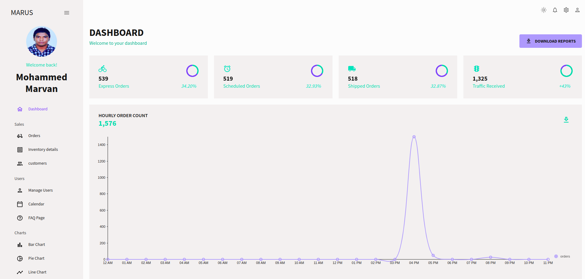
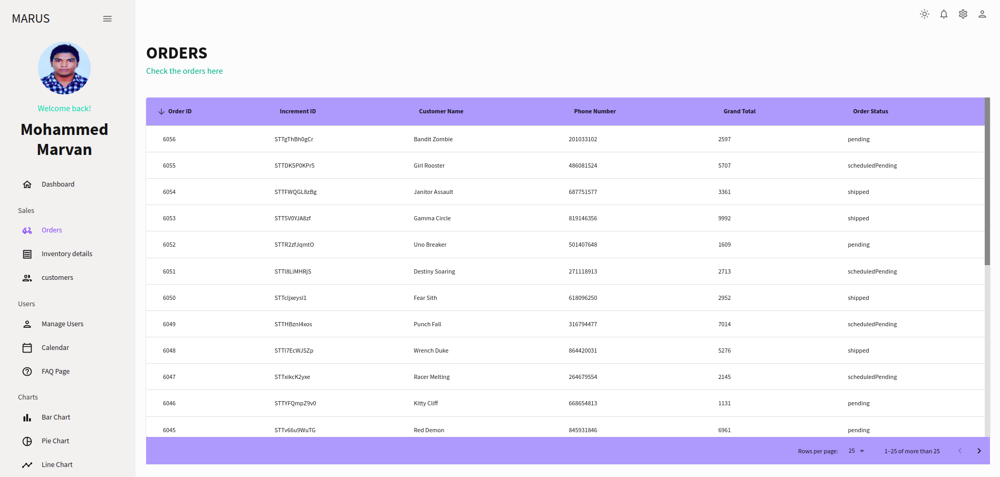
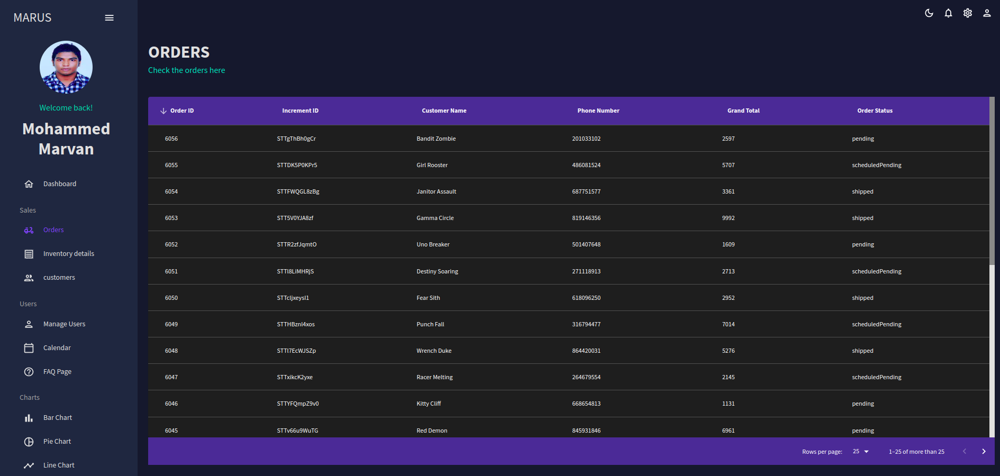
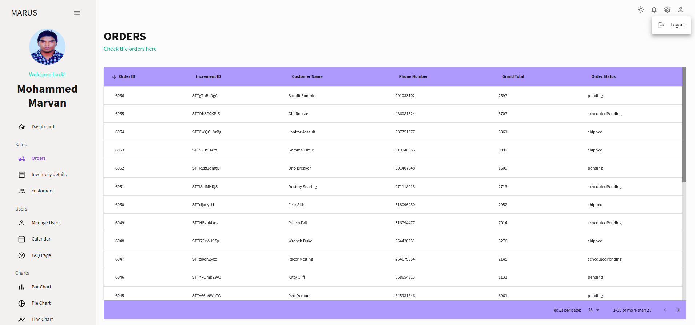

<p align="center">
    <h1 align="center">Nextjs Admin Dashbaord Intergrated Using Knexjs And SQL</h1>
    <div>
        
        
    </div>
    <div>
        
        
    </div>
</p>

## Special thanks

Thanks to EdRoh(@EdRohDev - youtube - https://youtu.be/wYpCWwD1oz0?list=PLIrDdeM009ItCBwCZK8K8JtXfIR9FPbm3) for the wonderfull admin design.

## Getting started

1. Download the repo

2. Install depencies

```bash
npm i
#or
yarn install
```
3. Create .env file and update .env file with below details

```bash
DB_HOST=
DB_PORT=
DB=
DB_USER=
DB_PASS=
```

4. Run the development server:

```bash
npm run dev
# or
yarn dev
# or
pnpm dev
```

Open [http://localhost:3000](http://localhost:3000) with your browser to see the result.
